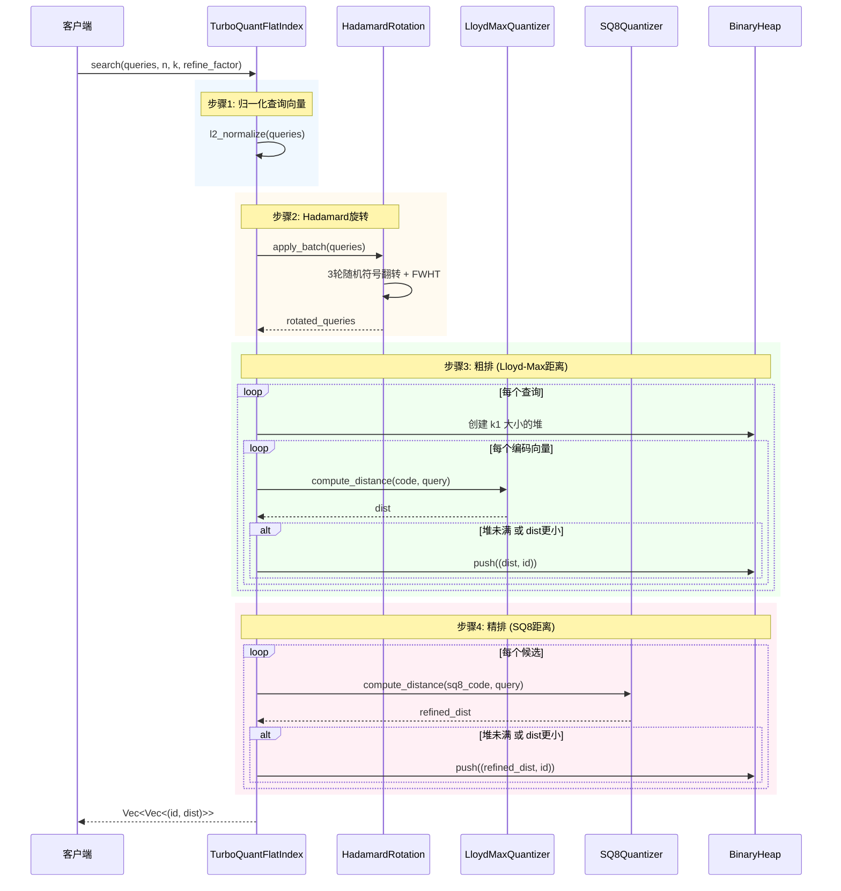
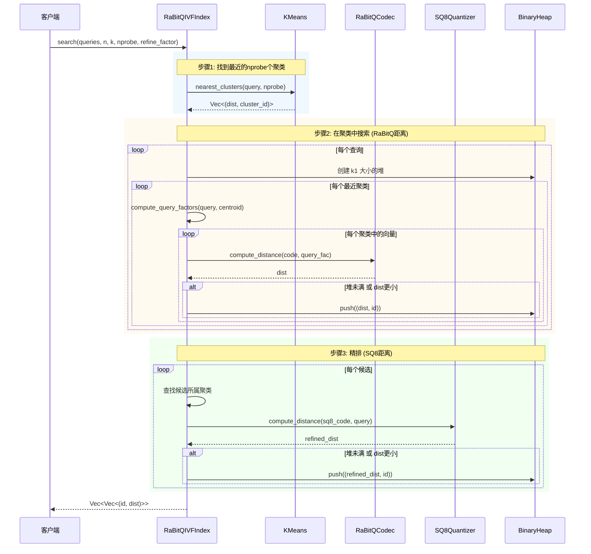
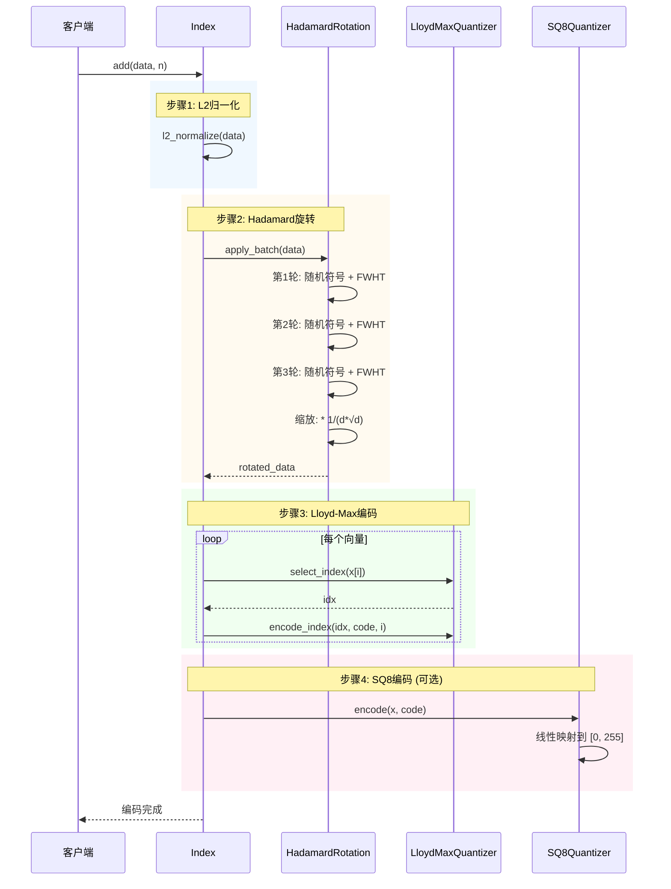
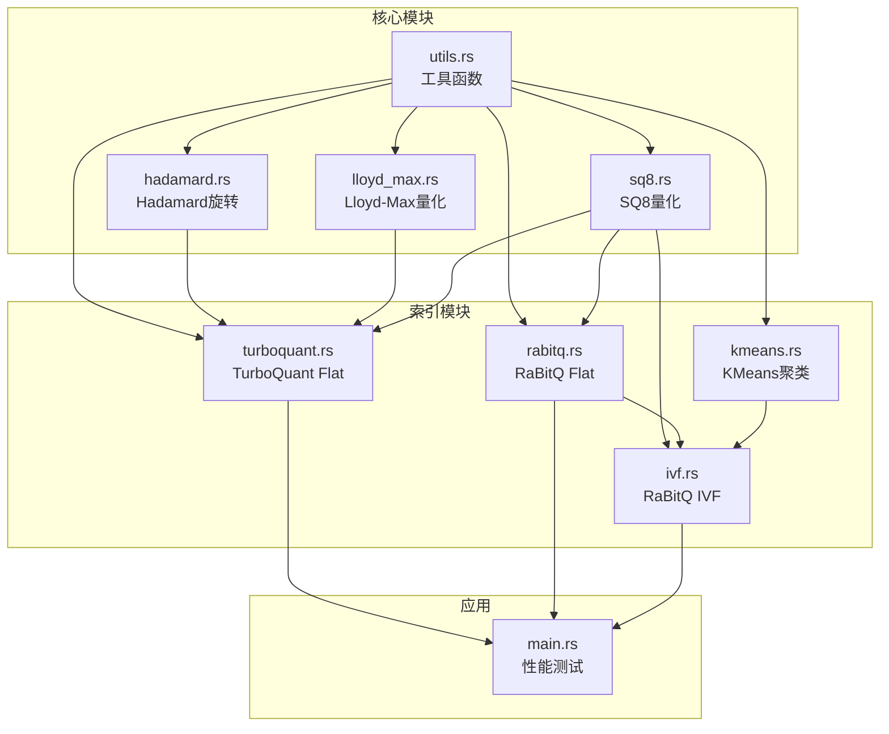
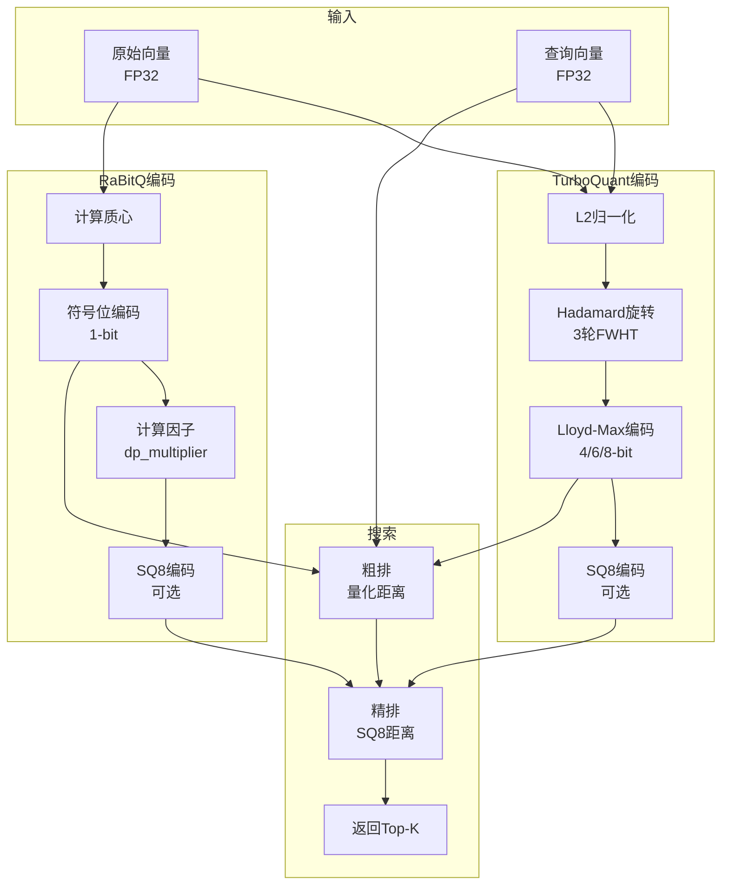

# TurboQuant 时序图

## 1. TurboQuant Flat + SQ8 搜索时序图



## 2. RaBitQ IVF + SQ8 搜索时序图



## 3. 向量编码时序图



## 4. Lloyd-Max 量化器初始化时序图

```mermaid
sequenceDiagram
    participant Client as 客户端
    participant Q as LloydMaxQuantizer

    Client->>Q: new(d, nbits)
    
    rect rgb(240, 248, 255)
        Note over Q: 步骤1: 初始化参数
        Q->>Q: k = 2^nbits
        Q->>Q: centroids = vec![0.0; k]
        Q->>Q: boundaries = vec![0.0; k-1]
    end
    
    rect rgb(255, 250, 240)
        Note over Q: 步骤2: Lloyd-Max迭代
        Q->>Q: 计算Beta分布权重
        Q->>Q: 初始分割: 等权重分割
        
        loop 最多100次迭代
            Q->>Q: 更新边界: boundary = (centroid[i] + centroid[i+1]) / 2
            Q->>Q: 更新分割点
            Q->>Q: 更新中心: 加权均值
            Q->>Q: 检查收敛: max_delta < 1e-8
        end
    end
    
    rect rgb(240, 255, 240)
        Note over Q: 步骤3: 计算边界
        Q->>Q: boundaries[i] = (centroids[i] + centroids[i+1]) / 2
    end
    
    Q-->>Client: 量化器就绪
```

## 5. Hadamard 旋转时序图

```mermaid
sequenceDiagram
    participant Client as 客户端
    participant H as HadamardRotation
    participant FWHT as FWHT

    Client->>H: apply(x)
    
    rect rgb(240, 248, 255)
        Note over H: 准备缓冲区
        H->>H: buf = [0.0; d_out]
        H->>H: 复制输入并应用第一轮符号
    end
    
    rect rgb(255, 250, 240)
        Note over H,FWHT: 第1轮: 符号翻转 + FWHT
        H->>H: buf[i] *= signs1[i]
        H->>FWHT: fwht_inplace(buf)
        FWHT->>FWHT: 蝶形运算 O(n log n)
        FWHT-->>H: buf
    end
    
    rect rgb(240, 255, 240)
        Note over H,FWHT: 第2轮: 符号翻转 + FWHT
        H->>H: buf[i] *= signs2[i]
        H->>FWHT: fwht_inplace(buf)
        FWHT-->>H: buf
    end
    
    rect rgb(255, 240, 245)
        Note over H,FWHT: 第3轮: 符号翻转 + FWHT
        H->>H: buf[i] *= signs3[i]
        H->>FWHT: fwht_inplace(buf)
        FWHT-->>H: buf
    end
    
    rect rgb(248, 248, 255)
        Note over H: 缩放
        H->>H: buf[i] *= scale (1/(d*√d))
    end
    
    H-->>Client: rotated vector
```

## 6. 模块依赖关系图



## 7. 数据流图


