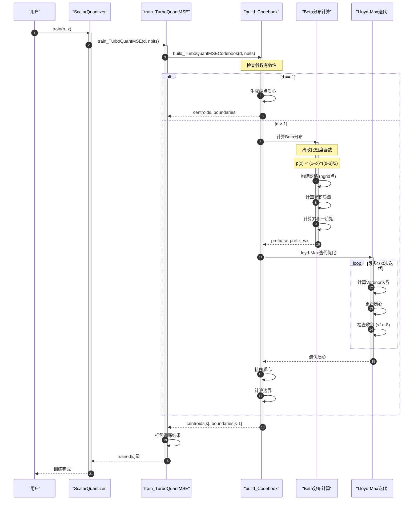
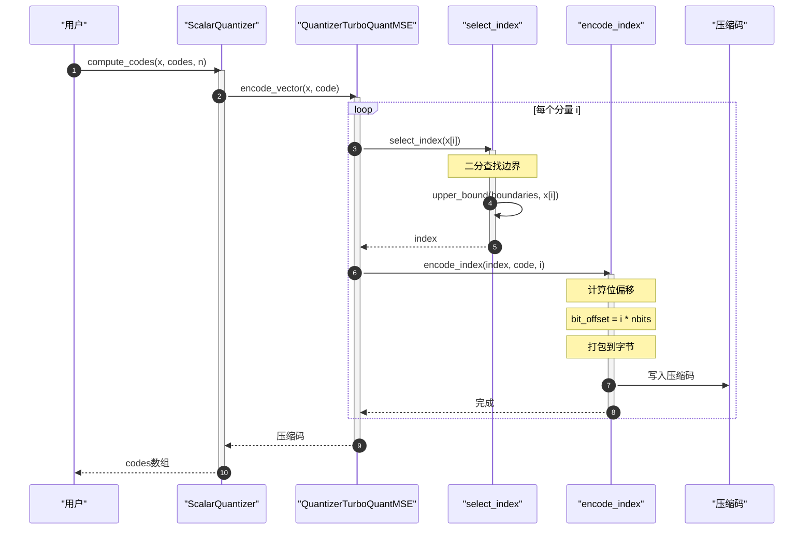
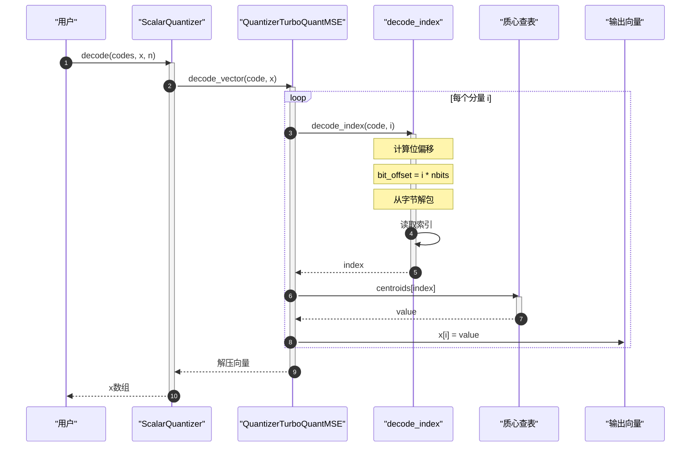
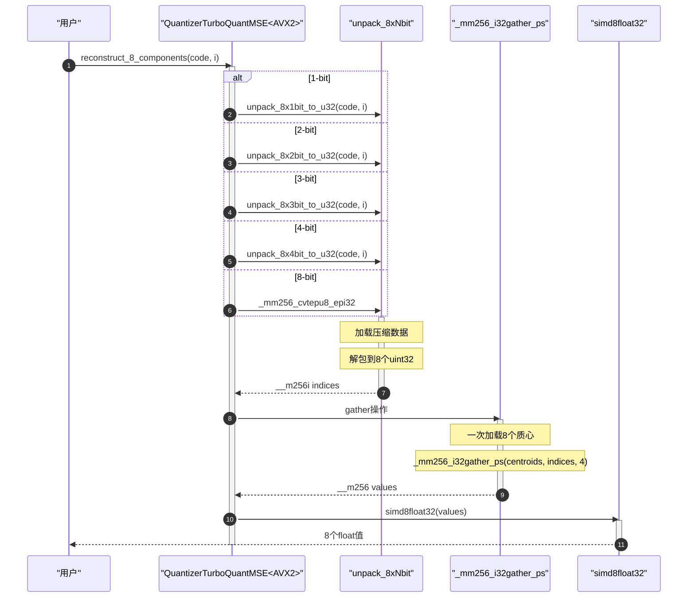
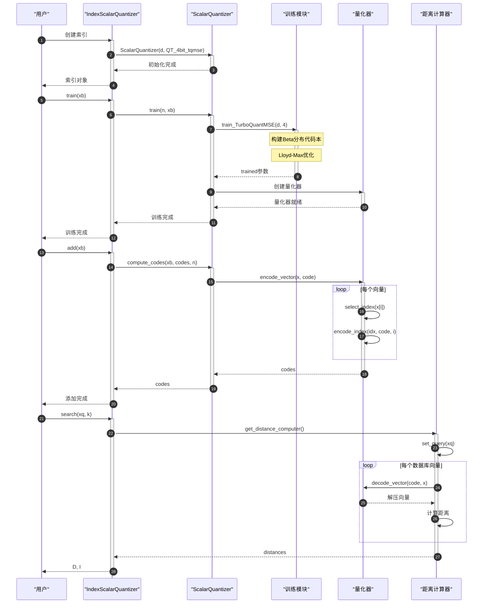
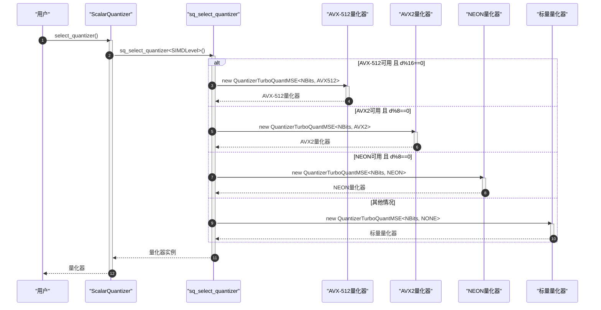
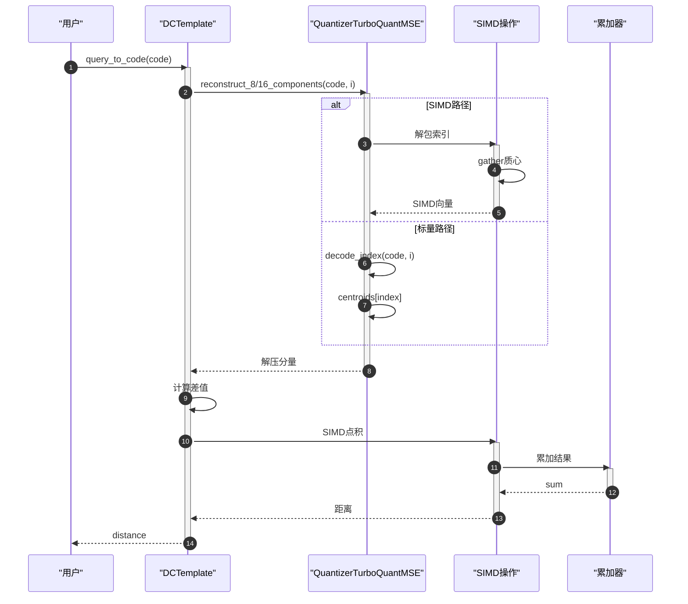

# FAISS TurboQuant 时序图

## 1. 训练阶段时序图

## 2. 量化阶段时序图

## 3. 反量化阶段时序图

## 4. SIMD 优化时序图 (AVX2)

## 5. 完整流程时序图

## 6. SIMD 分发时序图

## 7. 距离计算时序图

---

## 参与者说明

| 名称 | 对应代码 | 职责 |
|------|----------|------|
| 用户 | User code | 调用 FAISS API |
| ScalarQuantizer | ScalarQuantizer | 标量量化器主类 |
| train_TurboQuantMSE | training.cpp | TurboQuant 训练 |
| build_Codebook | training.cpp | 构建代码本 |
| Beta分布计算 | training.cpp | 计算 Beta 分布密度 |
| Lloyd-Max迭代 | training.cpp | Lloyd-Max 优化 |
| QuantizerTurboQuantMSE | quantizers.h | TurboQuant 量化器 |
| select_index | quantizers.h | 选择量化索引 |
| encode_index | quantizers.h | 编码索引到字节 |
| decode_index | quantizers.h | 从字节解码索引 |
| SIMD操作 | sq-*.cpp | SIMD 优化操作 |

## 关键步骤说明

**训练阶段**：
1. 检查参数有效性 (nbits ≤ 8)
2. 特殊情况处理 (d == 1)
3. 离散化 Beta 分布密度
4. Lloyd-Max 迭代优化
5. 排序并计算边界

**量化阶段**：
1. 对每个分量选择最近质心
2. 二分查找确定索引
3. 打包索引到压缩码

**反量化阶段**：
1. 从压缩码解包索引
2. 查表获取质心值
3. 组装输出向量

**SIMD 优化**：
1. 批量解包索引 (8/16个)
2. Gather 指令批量查表
3. SIMD 向量操作

## 性能优化点

1. **训练阶段**：
   - 无需训练数据
   - 解析计算代码本
   - 时间复杂度 O(nbits × iterations)

2. **量化阶段**：
   - 二分查找 O(log k)
   - 位打包减少内存
   - SIMD 并行处理

3. **反量化阶段**：
   - 查表操作 O(1)
   - SIMD Gather 加速
   - 缓存友好

4. **距离计算**：
   - 避免完全解压
   - SIMD 点积
   - 批量处理
