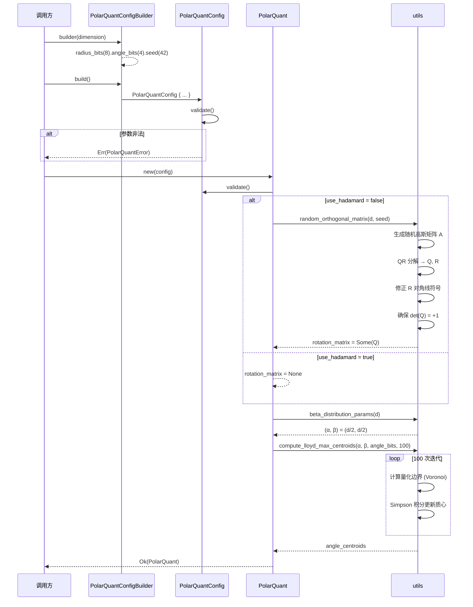
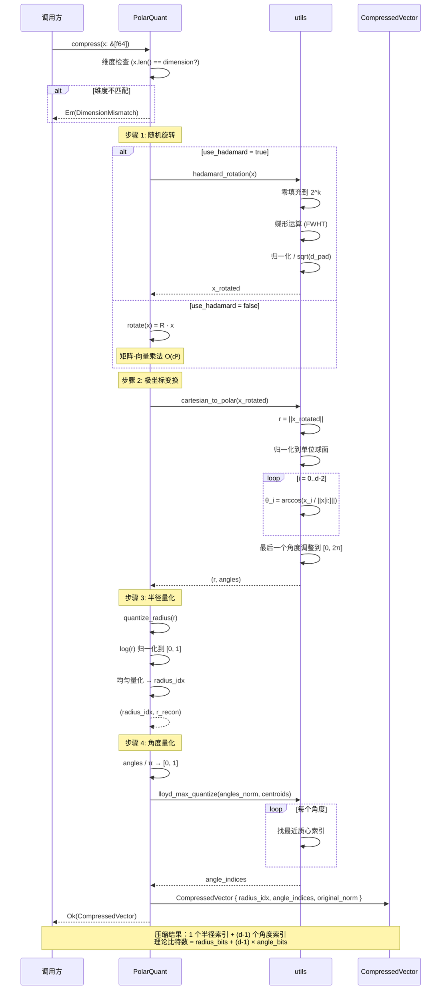
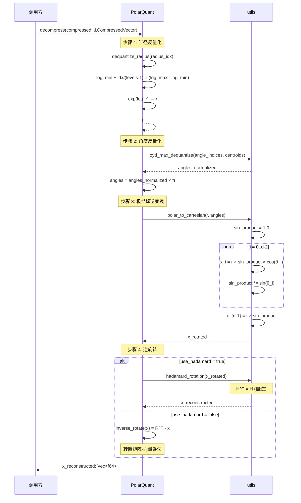
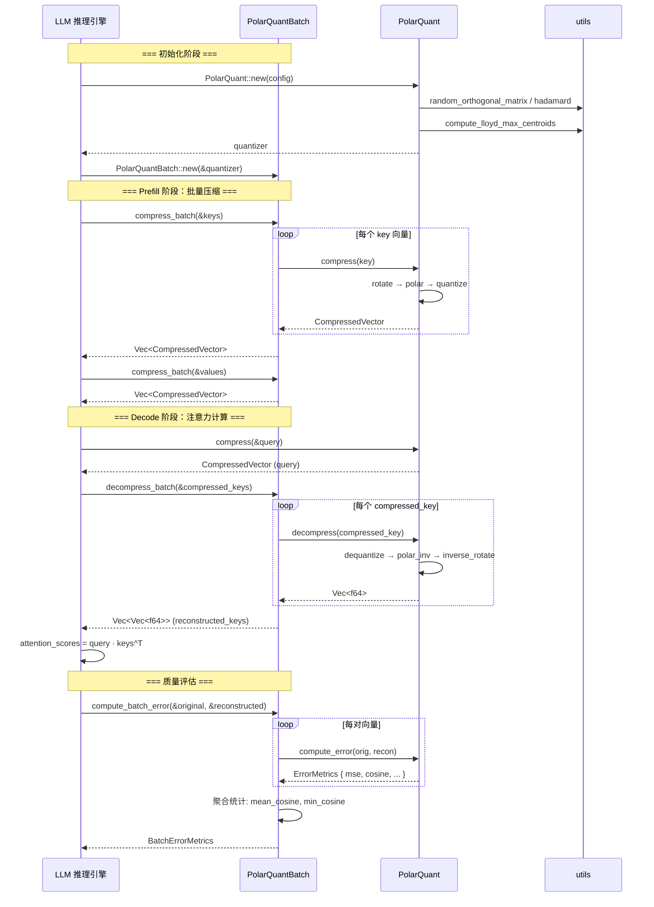
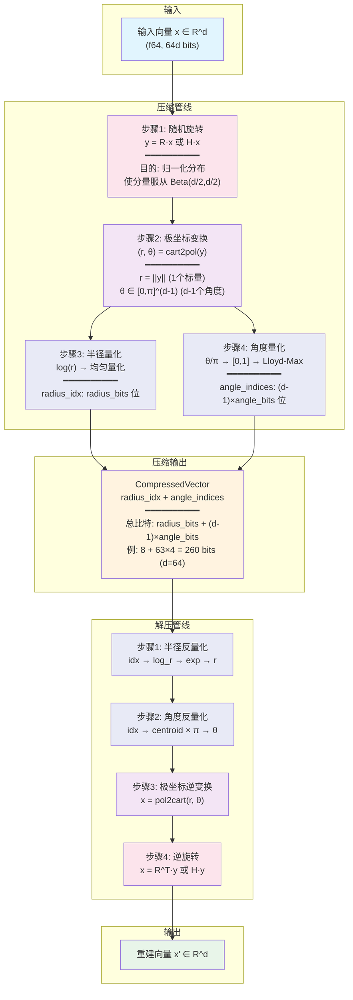
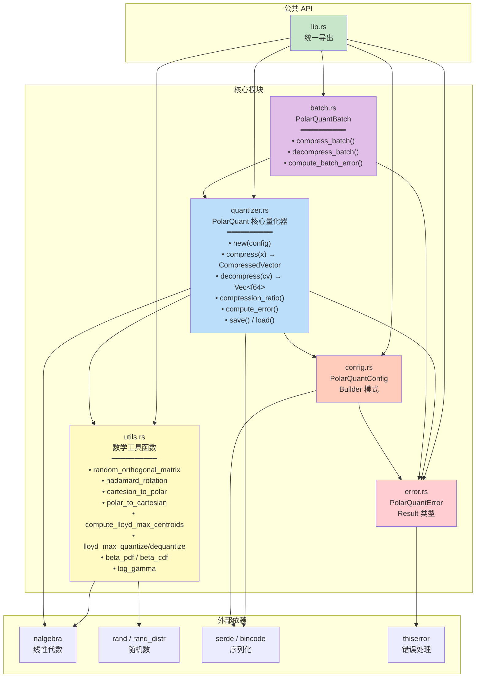
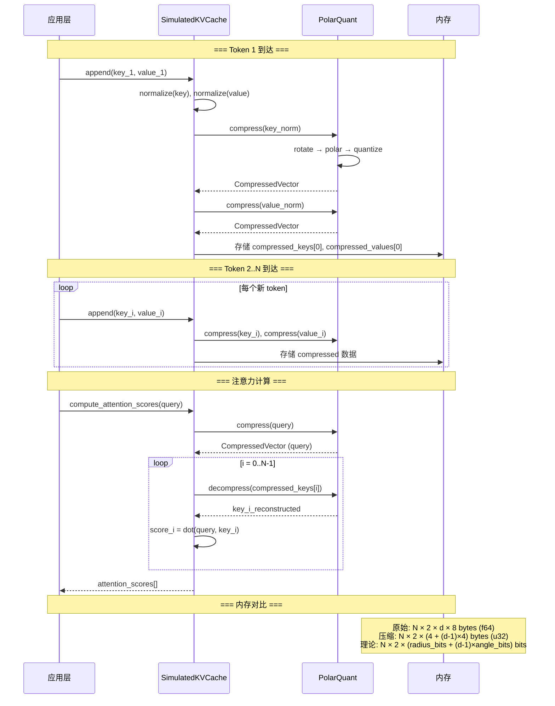

# PolarQuant 时序图

## 1. 初始化流程

```mermaid
sequenceDiagram
    participant User as 调用方
    participant Builder as PolarQuantConfigBuilder
    participant Config as PolarQuantConfig
    participant PQ as PolarQuant
    participant Utils as utils

    User->>Builder: builder(dimension)
    Builder-->>Builder: radius_bits(8).angle_bits(4).seed(42)

    User->>Builder: build()
    Builder->>Config: PolarQuantConfig { ... }
    Config->>Config: validate()
    alt 参数非法
        Config-->>User: Err(PolarQuantError)
    end

    User->>PQ: new(config)
    PQ->>Config: validate()

    alt use_hadamard = false
        PQ->>Utils: random_orthogonal_matrix(d, seed)
        Utils->>Utils: 生成随机高斯矩阵 A
        Utils->>Utils: QR 分解 → Q, R
        Utils->>Utils: 修正 R 对角线符号
        Utils->>Utils: 确保 det(Q) = +1
        Utils-->>PQ: rotation_matrix = Some(Q)
    else use_hadamard = true
        PQ-->>PQ: rotation_matrix = None
    end

    PQ->>Utils: beta_distribution_params(d)
    Utils-->>PQ: (α, β) = (d/2, d/2)

    PQ->>Utils: compute_lloyd_max_centroids(α, β, angle_bits, 100)
    loop 100 次迭代
        Utils->>Utils: 计算量化边界 (Voronoi)
        Utils->>Utils: Simpson 积分更新质心
    end
    Utils-->>PQ: angle_centroids

    PQ-->>User: Ok(PolarQuant)
```

## 2. 压缩流程 (compress)

```mermaid
sequenceDiagram
    participant User as 调用方
    participant PQ as PolarQuant
    participant Utils as utils
    participant CV as CompressedVector

    User->>PQ: compress(x: &[f64])

    PQ->>PQ: 维度检查 (x.len() == dimension?)
    alt 维度不匹配
        PQ-->>User: Err(DimensionMismatch)
    end

    Note over PQ: 步骤 1: 随机旋转
    alt use_hadamard = true
        PQ->>Utils: hadamard_rotation(x)
        Utils->>Utils: 零填充到 2^k
        Utils->>Utils: 蝶形运算 (FWHT)
        Utils->>Utils: 归一化 / sqrt(d_pad)
        Utils-->>PQ: x_rotated
    else use_hadamard = false
        PQ->>PQ: rotate(x) = R · x
        Note over PQ: 矩阵-向量乘法 O(d²)
    end

    Note over PQ: 步骤 2: 极坐标变换
    PQ->>Utils: cartesian_to_polar(x_rotated)
    Utils->>Utils: r = ||x_rotated||
    Utils->>Utils: 归一化到单位球面
    loop i = 0..d-2
        Utils->>Utils: θ_i = arccos(x_i / ||x[i:]||)
    end
    Utils->>Utils: 最后一个角度调整到 [0, 2π]
    Utils-->>PQ: (r, angles)

    Note over PQ: 步骤 3: 半径量化
    PQ->>PQ: quantize_radius(r)
    PQ->>PQ: log(r) 归一化到 [0, 1]
    PQ->>PQ: 均匀量化 → radius_idx
    PQ-->>PQ: (radius_idx, r_recon)

    Note over PQ: 步骤 4: 角度量化
    PQ->>PQ: angles / π → [0, 1]
    PQ->>Utils: lloyd_max_quantize(angles_norm, centroids)
    loop 每个角度
        Utils->>Utils: 找最近质心索引
    end
    Utils-->>PQ: angle_indices

    PQ->>CV: CompressedVector { radius_idx, angle_indices, original_norm }
    PQ-->>User: Ok(CompressedVector)

    Note over User,CV: 压缩结果：1 个半径索引 + (d-1) 个角度索引<br/>理论比特数 = radius_bits + (d-1) × angle_bits
```

## 3. 解压流程 (decompress)

```mermaid
sequenceDiagram
    participant User as 调用方
    participant PQ as PolarQuant
    participant Utils as utils

    User->>PQ: decompress(compressed: &CompressedVector)

    Note over PQ: 步骤 1: 半径反量化
    PQ->>PQ: dequantize_radius(radius_idx)
    PQ->>PQ: log_min + idx/(levels-1) × (log_max - log_min)
    PQ->>PQ: exp(log_r) → r
    PQ-->>PQ: r

    Note over PQ: 步骤 2: 角度反量化
    PQ->>Utils: lloyd_max_dequantize(angle_indices, centroids)
    Utils-->>PQ: angles_normalized
    PQ->>PQ: angles = angles_normalized × π

    Note over PQ: 步骤 3: 极坐标逆变换
    PQ->>Utils: polar_to_cartesian(r, angles)
    Utils->>Utils: sin_product = 1.0
    loop i = 0..d-2
        Utils->>Utils: x_i = r × sin_product × cos(θ_i)
        Utils->>Utils: sin_product *= sin(θ_i)
    end
    Utils->>Utils: x_{d-1} = r × sin_product
    Utils-->>PQ: x_rotated

    Note over PQ: 步骤 4: 逆旋转
    alt use_hadamard = true
        PQ->>Utils: hadamard_rotation(x_rotated)
        Note over Utils: H^T = H (自逆)
        Utils-->>PQ: x_reconstructed
    else use_hadamard = false
        PQ->>PQ: inverse_rotate(x) = R^T · x
        Note over PQ: 转置矩阵-向量乘法
    end

    PQ-->>User: x_reconstructed: Vec<f64>
```

## 4. 批量处理流程 (KV Cache 场景)

```mermaid
sequenceDiagram
    participant LLM as LLM 推理引擎
    participant Batch as PolarQuantBatch
    participant PQ as PolarQuant
    participant Utils as utils

    Note over LLM,Batch: === 初始化阶段 ===
    LLM->>PQ: PolarQuant::new(config)
    PQ->>Utils: random_orthogonal_matrix / hadamard
    PQ->>Utils: compute_lloyd_max_centroids
    PQ-->>LLM: quantizer

    LLM->>Batch: PolarQuantBatch::new(&quantizer)

    Note over LLM,Batch: === Prefill 阶段：批量压缩 ===
    LLM->>Batch: compress_batch(&keys)
    loop 每个 key 向量
        Batch->>PQ: compress(key)
        PQ->>PQ: rotate → polar → quantize
        PQ-->>Batch: CompressedVector
    end
    Batch-->>LLM: Vec<CompressedVector>

    LLM->>Batch: compress_batch(&values)
    Batch-->>LLM: Vec<CompressedVector>

    Note over LLM,Batch: === Decode 阶段：注意力计算 ===
    LLM->>PQ: compress(&query)
    PQ-->>LLM: CompressedVector (query)

    LLM->>Batch: decompress_batch(&compressed_keys)
    loop 每个 compressed_key
        Batch->>PQ: decompress(compressed_key)
        PQ->>PQ: dequantize → polar_inv → inverse_rotate
        PQ-->>Batch: Vec<f64>
    end
    Batch-->>LLM: Vec<Vec<f64>> (reconstructed_keys)

    LLM->>LLM: attention_scores = query · keys^T

    Note over LLM,Batch: === 质量评估 ===
    LLM->>Batch: compute_batch_error(&original, &reconstructed)
    loop 每对向量
        Batch->>PQ: compute_error(orig, recon)
        PQ-->>Batch: ErrorMetrics { mse, cosine, ... }
    end
    Batch->>Batch: 聚合统计: mean_cosine, min_cosine
    Batch-->>LLM: BatchErrorMetrics
```

## 5. 完整数据流图

```mermaid
flowchart TB
    subgraph 输入
        X["输入向量 x ∈ R^d<br/>(f64, 64d bits)"]
    end

    subgraph 压缩管线
        direction TB
        R1["步骤1: 随机旋转<br/>y = R·x 或 H·x<br/>━━━━━━━━━━<br/>目的: 归一化分布<br/>使分量服从 Beta(d/2,d/2)"]
        P["步骤2: 极坐标变换<br/>(r, θ) = cart2pol(y)<br/>━━━━━━━━━━<br/>r = ||y|| (1个标量)<br/>θ ∈ [0,π]^(d-1) (d-1个角度)"]
        QR["步骤3: 半径量化<br/>log(r) → 均匀量化<br/>━━━━━━━━━━<br/>radius_idx: radius_bits 位"]
        QA["步骤4: 角度量化<br/>θ/π → [0,1] → Lloyd-Max<br/>━━━━━━━━━━<br/>angle_indices: (d-1)×angle_bits 位"]
    end

    subgraph 压缩输出
        CV["CompressedVector<br/>radius_idx + angle_indices<br/>━━━━━━━━━━<br/>总比特: radius_bits + (d-1)×angle_bits<br/>例: 8 + 63×4 = 260 bits (d=64)"]
    end

    subgraph 解压管线
        direction TB
        DQR["步骤1: 半径反量化<br/>idx → log_r → exp → r"]
        DQA["步骤2: 角度反量化<br/>idx → centroid × π → θ"]
        DP["步骤3: 极坐标逆变换<br/>x = pol2cart(r, θ)"]
        R2["步骤4: 逆旋转<br/>x = R^T·y 或 H·y"]
    end

    subgraph 输出
        XR["重建向量 x' ∈ R^d"]
    end

    X --> R1 --> P --> QR --> CV
    P --> QA --> CV
    CV --> DQR --> DQA --> DP --> R2 --> XR

    style X fill:#e1f5fe
    style CV fill:#fff3e0
    style XR fill:#e8f5e9
    style R1 fill:#fce4ec
    style R2 fill:#fce4ec
    style P fill:#f3e5f5
    style DP fill:#f3e5f5
    style QR fill:#e8eaf6
    style QA fill:#e8eaf6
    style DQR fill:#e8eaf6
    style DQA fill:#e8eaf6
```

## 6. 模块依赖关系图

```mermaid
graph TB
    subgraph 公共 API
        LIB["lib.rs<br/>统一导出"]
    end

    subgraph 核心模块
        CONFIG["config.rs<br/>PolarQuantConfig<br/>Builder 模式"]
        ERROR["error.rs<br/>PolarQuantError<br/>Result 类型"]
        UTILS["utils.rs<br/>数学工具函数<br/>━━━━━━━━━━<br/>• random_orthogonal_matrix<br/>• hadamard_rotation<br/>• cartesian_to_polar<br/>• polar_to_cartesian<br/>• compute_lloyd_max_centroids<br/>• lloyd_max_quantize/dequantize<br/>• beta_pdf / beta_cdf<br/>• log_gamma"]
        QUANT["quantizer.rs<br/>PolarQuant 核心量化器<br/>━━━━━━━━━━<br/>• new(config)<br/>• compress(x) → CompressedVector<br/>• decompress(cv) → Vec&lt;f64&gt;<br/>• compression_ratio()<br/>• compute_error()<br/>• save() / load()"]
        BATCH["batch.rs<br/>PolarQuantBatch<br/>━━━━━━━━━━<br/>• compress_batch()<br/>• decompress_batch()<br/>• compute_batch_error()"]
    end

    subgraph 外部依赖
        NALGEBRA["nalgebra<br/>线性代数"]
        RAND["rand / rand_distr<br/>随机数"]
        SERDE["serde / bincode<br/>序列化"]
        THISERROR["thiserror<br/>错误处理"]
    end

    LIB --> CONFIG
    LIB --> ERROR
    LIB --> UTILS
    LIB --> QUANT
    LIB --> BATCH

    QUANT --> CONFIG
    QUANT --> ERROR
    QUANT --> UTILS

    BATCH --> QUANT
    BATCH --> ERROR

    CONFIG --> ERROR

    UTILS --> NALGEBRA
    UTILS --> RAND
    QUANT --> NALGEBRA
    QUANT --> SERDE
    CONFIG --> SERDE
    ERROR --> THISERROR

    style LIB fill:#c8e6c9
    style QUANT fill:#bbdefb
    style UTILS fill:#fff9c4
    style BATCH fill:#e1bee7
    style CONFIG fill:#ffccbc
    style ERROR fill:#ffcdd2
```

## 7. KV Cache 应用时序图

```mermaid
sequenceDiagram
    participant App as 应用层
    participant Cache as SimulatedKVCache
    participant PQ as PolarQuant
    participant Mem as 内存

    Note over App,Mem: === Token 1 到达 ===
    App->>Cache: append(key_1, value_1)
    Cache->>Cache: normalize(key), normalize(value)
    Cache->>PQ: compress(key_norm)
    PQ->>PQ: rotate → polar → quantize
    PQ-->>Cache: CompressedVector
    Cache->>PQ: compress(value_norm)
    PQ-->>Cache: CompressedVector
    Cache->>Mem: 存储 compressed_keys[0], compressed_values[0]

    Note over App,Mem: === Token 2..N 到达 ===
    loop 每个新 token
        App->>Cache: append(key_i, value_i)
        Cache->>PQ: compress(key_i), compress(value_i)
        Cache->>Mem: 存储 compressed 数据
    end

    Note over App,Mem: === 注意力计算 ===
    App->>Cache: compute_attention_scores(query)

    Cache->>PQ: compress(query)
    PQ-->>Cache: CompressedVector (query)

    loop i = 0..N-1
        Cache->>PQ: decompress(compressed_keys[i])
        PQ-->>Cache: key_i_reconstructed
        Cache->>Cache: score_i = dot(query, key_i)
    end

    Cache-->>App: attention_scores[]

    Note over App,Mem: === 内存对比 ===
    Note over Mem: 原始: N × 2 × d × 8 bytes (f64)<br/>压缩: N × 2 × (4 + (d-1)×4) bytes (u32)<br/>理论: N × 2 × (radius_bits + (d-1)×angle_bits) bits
```
