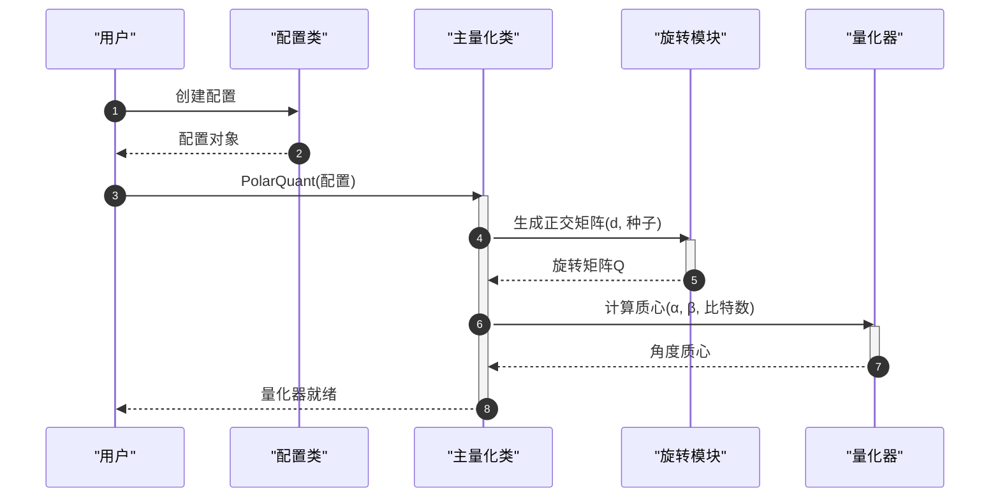
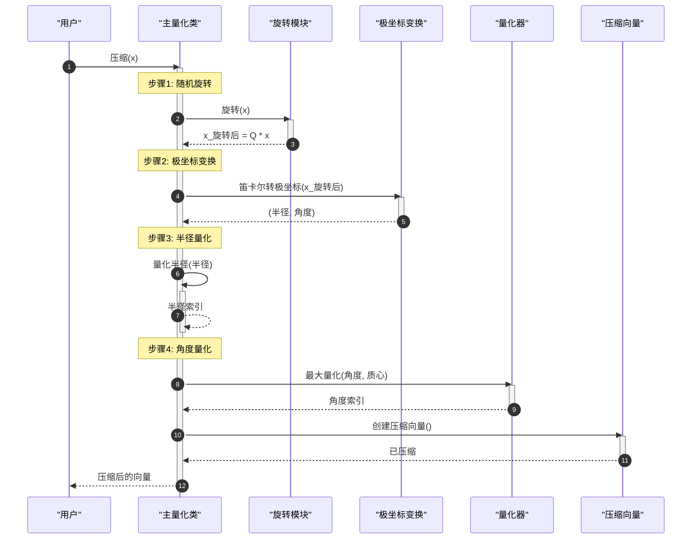
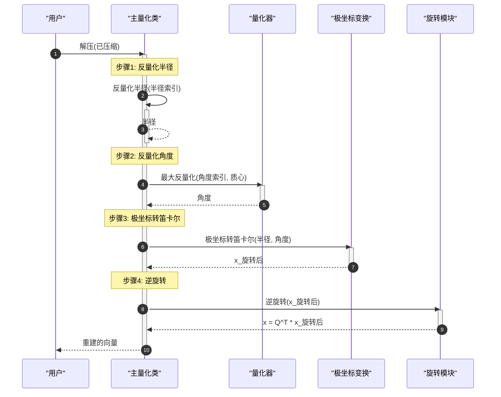
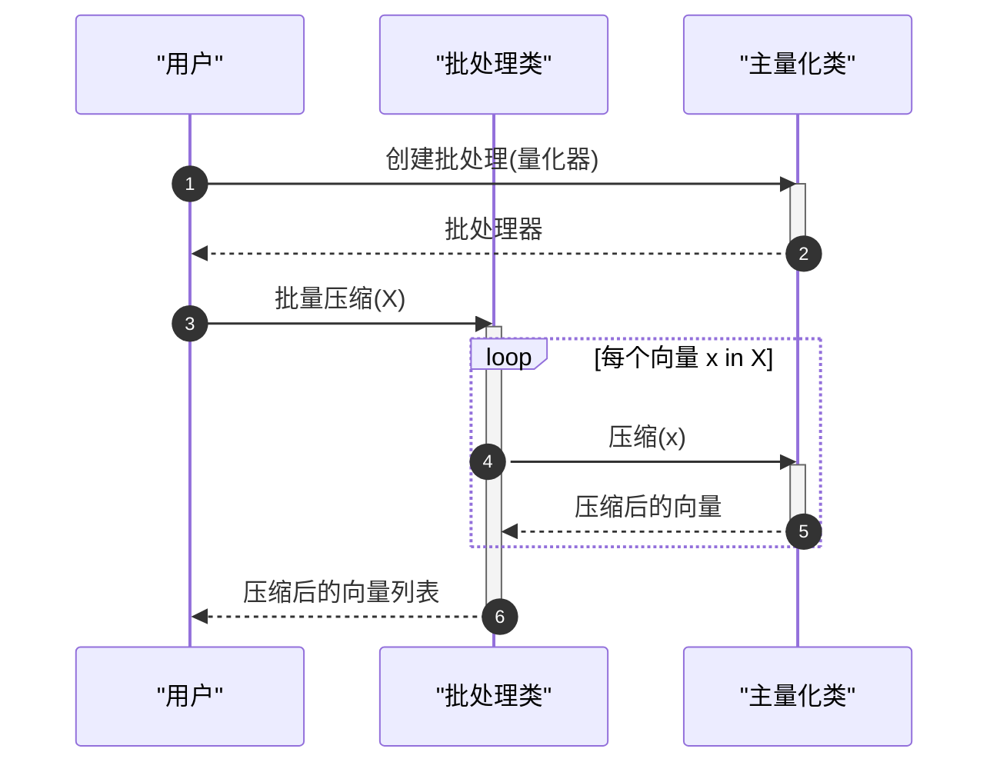
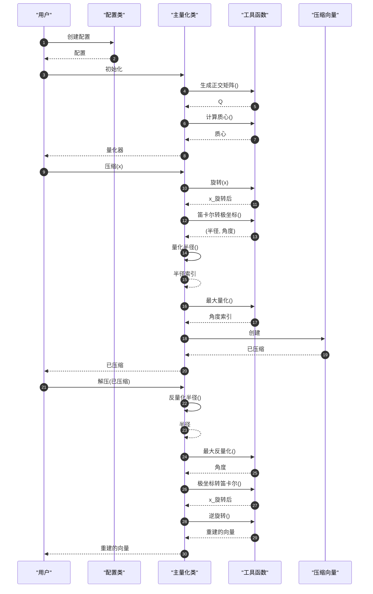

# PolarQuant 时序图

## 1. 初始化阶段



## 2. 压缩阶段



## 3. 解压阶段



## 4. 批处理阶段



## 5. 完整流程



---

## 参与者说明

| 名称 | 对应代码 | 职责 |
|------|----------|------|
| 用户 | User code | 调用 PolarQuant API |
| 配置类 | `core.py` 配置类 | 存储量化参数 |
| 主量化类 | `core.py` 主类 | 实现压缩/解压算法 |
| 旋转模块 | `utils.py` | 生成旋转矩阵 Q |
| 极坐标变换 | `utils.py` | 坐标系转换 |
| 量化器 | `utils.py` | 计算质心和量化 |
| 压缩向量 | `core.py` 数据类 | 存储压缩结果 |
| 工具函数 | `utils.py` | 数学运算工具 |
| 批处理类 | `core.py` | 批量处理向量 |

## 关键步骤说明

**阶段 1: 初始化**
1. 用户创建配置
2. 初始化主量化类
3. 生成随机正交矩阵 Q (QR分解)
4. 计算 Lloyd-Max 质心 (基于 Beta 分布)
5. 返回量化器实例

**阶段 2: 压缩**
1. 随机旋转: y = Q @ x (将分布归一化为 Beta 分布)
2. 极坐标变换: (半径, 角度) = 笛卡尔转极坐标(y)
3. 半径量化: 半径 → 半径索引 (对数尺度)
4. 角度量化: 角度 → 角度索引 (Lloyd-Max 最优量化)
5. 存储索引: 返回压缩向量

**阶段 3: 解压**
1. 反量化半径: 半径索引 → 半径
2. 反量化角度: 角度索引 → 角度
3. 极坐标转笛卡尔: (半径, 角度) → y
4. 逆旋转: x = Q^T @ y
5. 返回重建向量

**阶段 4: 批处理**
- 对多个向量循环处理
- 复用同一个量化器实例

## 压缩比计算

```
原始大小: d × 32 bits (float32)
压缩大小: r_bits + (d-1) × a_bits

示例: d=256, r_bits=8, a_bits=4
原始: 256 × 32 = 8192 bits
压缩: 8 + 255 × 4 = 1028 bits
压缩比: 8192 / 1028 ≈ 7.97x
```

## 核心公式

**随机旋转:**
```
y = Q · x
Q: 随机正交矩阵 (Q @ Q^T = I)
```

**极坐标变换:**
```
x_0 = 半径 · cos(角度_0)
x_1 = 半径 · sin(角度_0) · cos(角度_1)
x_2 = 半径 · sin(角度_0) · sin(角度_1) · cos(角度_2)
...
```

**Lloyd-Max 量化:**
```
边界: b_i = (c_{i-1} + c_i) / 2
质心: c_i = E[X | b_i < X < b_{i+1}]
```
